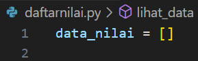
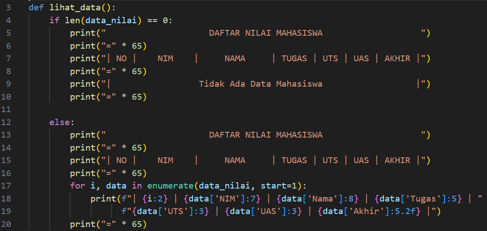
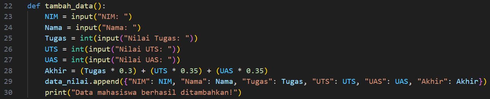
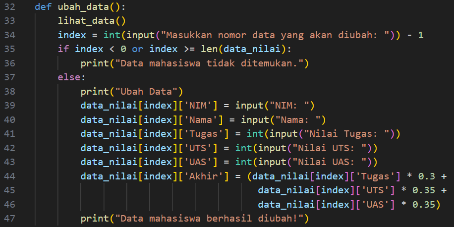
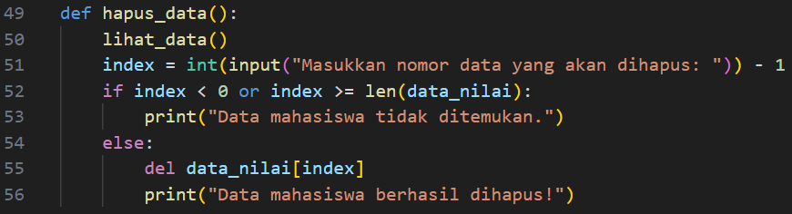
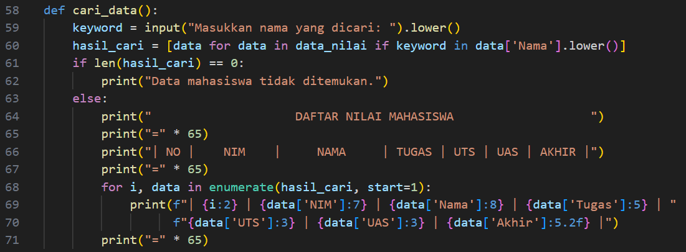
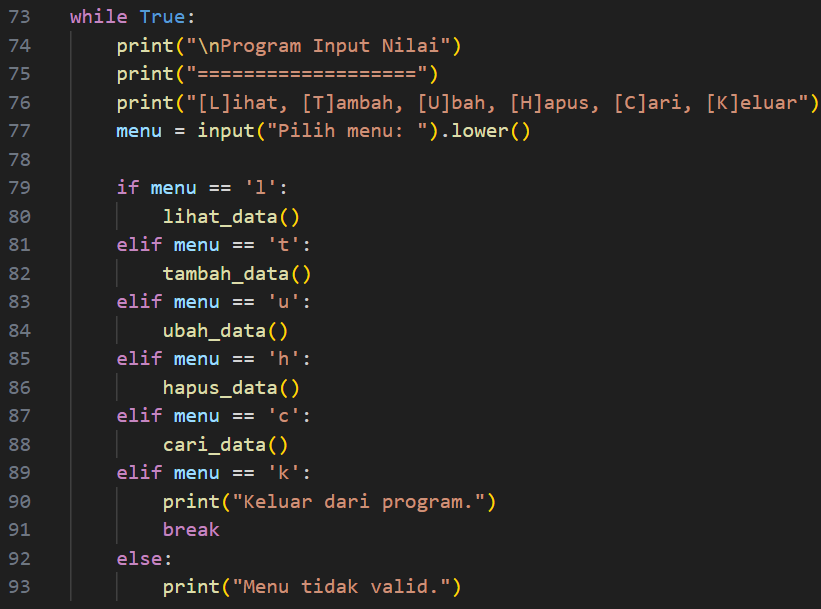

DAFTAR ISI
==========
- [LAPORAN PRAKTIKUM 5](#laporan-praktikum-5)   
    - [CODE PROGRAM DAFTAR NILAI](#code-program-daftar-nilai)
    - [FLOWCHART DAFTAR NILAI]()
    - [KESIMPULAN]()

# LAPORAN PRAKTIKUM 5

## CODE PROGRAM DAFTAR NILAI

### Step 1 : Inisialisasi Data
Tambahkan variabel data_nilai sebagai list kosong yang digunakan untuk menyimpan data mahasiswa, setiap elemen dalam list adalah dictionary yang berisi informasi mahasiswa, seperti NIM, Nama, Nilai Tugas, Nilai UTS, Nilai UAS, dan Nilai Akhir yang akan diinputkan :

### Step 2 : Fungsi lihat_data
Fungsi ini digunakan untuk menampilkan daftar nilai mahasiswa :
- Jika data_nilai kosong, akan muncul pesan "Tidak Ada Data Mahasiswa".
- Jika data_nilai berisi data, ditampilkan dalam bentuk tabel, tabel akan berisikan data yang sudah diinputkan oleh user NIM, Nama, Nilai Tugas, Nilai UTS, Nilai UAS, dan Nilai Akhir.

### Step 3 : Fungsi tambah_data
Fungsi ini digunakan untuk menambahkan data nilai mahasiswa ke dalam data_nilai. Langkah-langkahnya, Meminta input dari pengguna untuk NIM, Nama, Nilai Tugas, Nilai UTS, dan Nilai UAS, menghitung nilai akhir dengan bobot (Tugas: 30%, UTS: 35%, UAS: 35%), menambahkan data mahasiswa dalam bentuk dictionary ke list data_nilai. Perintah .append berfungsi untuk menambahkan data/memasukan tambahan data baru ke yang sudah disediakan :

### Step 4 : Fungsi ubah_data
Fungsi ini digunakan untuk mengubah data mahasiswa berdasarkan nomor yang dipilih menampilkan data mahasiswa dengan lihat_data serta meminta pengguna memilih nomor data yang ingin diubah, hal ini mencakup semua data dari NIM, Nama, Nilai Tugas, Nilai UTS, dan Nilai UAS yang diubah, namun ada 2 kondisi dalam kasus ini :
- Jika nomor tidak valid, tampilkan pesan "Data tidak ditemukan".
- Jika valid, memperbarui data dengan input baru.

### Step 5 : Fungsi hapus_data
Fungsi ini menghapus data mahasiswa dari data_nilai yang sudah tercantumkan datanya pada tabel. outputnya akan menampilkan daftar data dan meminta nomor data yang akan dihapus. Jika nomor valid, data dihapus dengan del :

### Step 6 : Fungsi cari_data
Fungsi ini mencari data mahasiswa berdasarkan nama yang sudah tertera/data pada tabel data dengan menggunakan list comprehension untuk mencari nama yang cocok (case-insensitive), jika ditemukan akan menampilkan data mahasiswa jika tidak, menampilkan pesan "Data tidak ditemukan" :

### Step 7 : Main Loop
Loop ini merupakan antarmuka utama program:
Menampilkan menu pilihan.
Berdasarkan input pengguna:
L: Memanggil lihat_data.
T: Memanggil tambah_data.
U: Memanggil ubah_data.
H: Memanggil hapus_data.
C: Memanggil cari_data.
K: Keluar dari program.
Jika input tidak valid, menampilkan pesan "Menu tidak valid".

